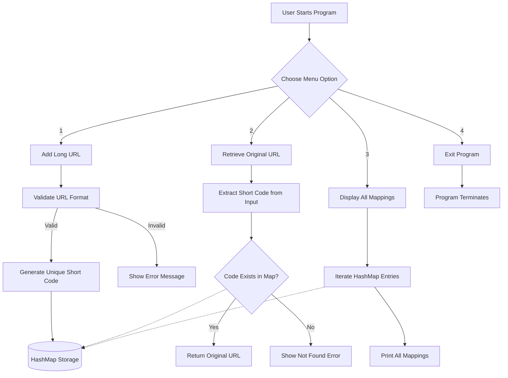

<div align="center">

# 🔗 URL Shortener — Java Console Application

**A lightweight, HashMap-powered URL shortening system built with Core Java**

[](https://www.java.com/)
[](#)
[](#)
[](#)
[](#)

</div>

---

## 📖 Overview

**URL Shortener** is a beginner-friendly, single-file Java console application that mimics the core functionality of real-world URL shortening services (like Bitly or TinyURL). It uses a `HashMap` for in-memory storage — no database, no external libraries, no frameworks — making it ideal as an academic mini project or a portfolio piece demonstrating clean Core Java fundamentals.

---

## ✨ Features

| # | Feature | Description |
|---|---------|--------------|
| 1 | 🔗 Add Long URL | Accepts and validates a long URL, generates a unique 6-character short code |
| 2 | 🔍 Retrieve Original URL | Looks up the original URL using a short code or full short link |
| 3 | 📋 Display All Mappings | Lists every stored short code ↔ long URL pair |
| 4 | 🚪 Exit | Gracefully terminates the program |
| 5 | ✅ Input Validation | Rejects empty input and URLs missing `http://` / `https://` |
| 6 | ⚠️ Error Handling | Gracefully handles invalid or non-existent short codes |
| 7 | 🎲 Unique Code Generation | Random alphanumeric codes with duplicate-collision checks |

---

## 🏗️ System Architecture



---

## 🗂️ Project Structure

```
url-shortener-java/
│
├── URLShortener.java   → Single-file source code (entire application)
└── README.md           → Project documentation
```

---

## ⚙️ Tech Stack

| Component | Technology |
|-----------|------------|
| Language | Java (Core, JDK 17+) |
| Storage | `HashMap<String, String>` (in-memory) |
| Interface | Console / Terminal |
| Dependencies | None |
| Build Tool | None (plain `javac`) |

---

## 🚀 How to Run

```bash
# 1. Compile the program
javac URLShortener.java

# 2. Run the program
java URLShortener
```

> 💡 Works in VS Code, IntelliJ IDEA, Eclipse, or any terminal with JDK installed — no additional setup required.

---

## 🧪 Sample Output

```
=========================================
        URL SHORTENER - MINI PROJECT     
=========================================

---------------- MENU ------------------
1. Add a long URL
2. Retrieve original URL from short code
3. Display all saved URL mappings
4. Exit
Enter your choice: 1

Enter the long URL: https://www.example.com/very/long/path/to/page
Short URL created successfully!
Short URL: https://short.ly/rPlARQ
Short Code: rPlARQ

Enter your choice: 2
Enter the short code (e.g., https://short.ly/xxxxxx or just xxxxxx): rPlARQ
Original URL: https://www.example.com/very/long/path/to/page

Enter your choice: 3
---------- SAVED URL MAPPINGS ----------
https://short.ly/rPlARQ  ->  https://www.example.com/very/long/path/to/page

Enter your choice: 4
Thank you for using URL Shortener. Bye!
```

---

## 🔮 Future Enhancements

- 📁 Persist mappings to a file (so data survives program restart)
- ⏰ Add expiry time for short links
- 📊 Track click count per short code
- 🖥️ Convert to a GUI (JavaFX / Swing) or Web app (Spring Boot)

---

## 👩‍💻 Author

**Sneha Latha**
B.Tech CSE (AI & ML) | Siddartha Institute of Science and Technology, Puttur
GitHub: [@snehalathaArakkonam](https://github.com/snehalathaArakkonam)

---

<div align="center">

### 🙏 Thank You / ధన్యవాదాలు

**English:** This project demonstrates core Java fundamentals — collections, control flow, and clean console I/O — built as a placement-ready portfolio piece.

**తెలుగు:** ఈ ప్రాజెక్ట్ కోర్ జావా ఫండమెంటల్స్‌ని ప్రదర్శిస్తుంది — కలెక్షన్స్, కంట్రోల్ ఫ్లో, మరియు క్లీన్ కన్సోల్ I/O — ప్లేస్‌మెంట్ కోసం సిద్ధంగా ఉన్న పోర్ట్‌ఫోలియో ప్రాజెక్ట్‌గా రూపొందించబడింది.

⭐ **If you found this useful, consider starring the repo!** ⭐

</div>
```
